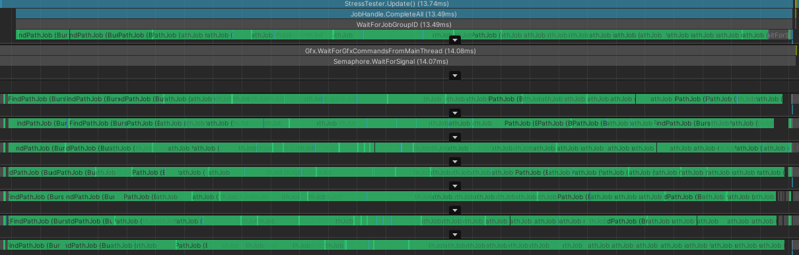

# About
Unity project showcasing A* pathfinding, fully jobified &amp; burst compiled. The grid that is used to perform pathfinding is also built using jobs, with raycasting to scan the walkable floor and boxcasting to bake the obstacles. 

Pathfinding is performed for each agent, each frame. It uses four neighbours and no path smoothing / postprocess is done. There is no local avoidance, so agents will overlap. Agents are moved using the IJobParallelForTransform. A lot of improvements could be made, but the intention was to benchmark how many paths per frame my PC could handle at a reasonable framerate.

Keep jobs leak detection, safety checks and jobsdebugger deactivated to avoid overhead.

# Benchmark
The laptop I used (i7-7700hq) can handle ~500 agents around 16ms (~60 fps) at the start of the game in the provided scene, in a build. Note that as agents move and get closer to the goal, the computation time decreases, so if you are CPU bound expect the framerate to increase as agents get closer to the end of the path.

# Preview

# Pathfinding profiling

# Grid creation profiling

